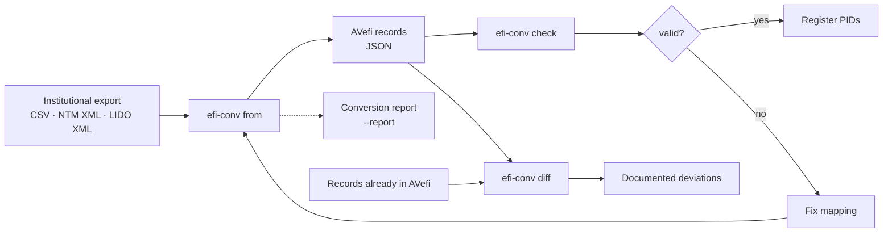
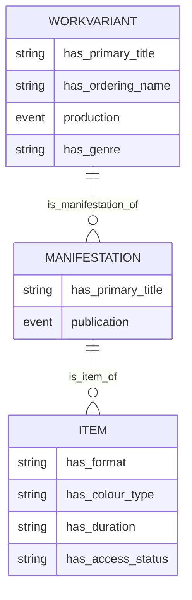
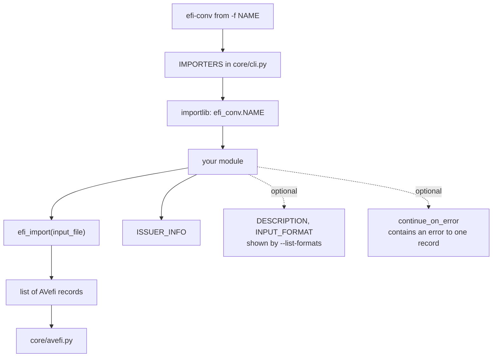

<div align="center">

# efi-conv

**Convert collection metadata to the [AVefi schema][] — and prove that nothing was lost on the way.**

[](https://opensource.org/licenses/MIT)
[](https://www.python.org/)
[][uv_install]
[](https://github.com/AV-EFI/efi-conv/pkgs/container/efi-conv)

</div>

Reference repository for creating mappings to the [AVefi schema][]. If
you consider contributing data to the [AVefi project][], that is,
registering persistent identifiers for some audio-visual material in
your collection, this may be a good place to start. Contributions are
very welcome. Feel free to fork and submit pull requests or otherwise
get in touch and let us jointly work on your mapping.

[AVefi project]: https://projects.tib.eu/av-efi/
[AVefi schema]: https://av-efi.github.io/av-efi-schema/

**Contents** · [What it does](#what-it-does) · [Quick start](#quick-start) ·
[Commands](#commands) · [Converters](#available-converters) ·
[Conversion report](#conversion-report) · [Comparing against AVefi](#comparing-against-avefi) ·
[Writing a converter](#writing-a-converter) · [Development](#development) ·
[Troubleshooting](#troubleshooting)

---

## What it does

A converter reads the export format of one institution and produces
records complying with the AVefi schema, ready to have persistent
identifiers registered for them. Values that cannot be converted are
never dropped in silence: they are logged, and `--report` collects them
in a machine readable protocol.



The AVefi schema describes holdings on three levels, and a converter is
expected to produce all three. A work is the film, a manifestation is
one of its versions, an item is a physical or digital copy an
institution actually holds:



Note that several source records commonly describe several copies of
the same film. A converter should recognise that and emit one work with
several items, rather than one work per copy — otherwise the
identifiers it registers describe copies rather than films, which is
the opposite of what the AVefi project is for.

---

## Quick start

### With Docker

For seasoned Docker users, here is how to run the checks against your
data in a few simple steps:

```console
$ git clone https://github.com/AV-EFI/efi-conv.git
$ cd efi-conv
$ docker-compose pull
## If that does not work run:
## $ docker-compose build
$ docker-compose run efi-conv check tests/avportal/efi_records.json
INFO efi_conv.core.check: Processing tests/avportal/efi_records.json
INFO efi_conv.core.check: All 3 records passed the checks successfully
```

The container runs as an unprivileged user whose UID and GID default to
1000, so files it writes into the mounted working directory belong to
you rather than to root. Override them at build time if your account
uses different ones:

```console
$ UID=$(id -u) GID=$(id -g) docker-compose build
```

### With uv

Everyone else should rather set up a dedicated virtual environment,
preferably using the [dependency manager UV][uv_install]:

```console
$ git clone https://github.com/AV-EFI/efi-conv.git
$ cd efi-conv
$ uv sync --no-python-downloads
$ uv run efi-conv --help
```

Convert some test data and validate the result:

```console
$ uv run efi-conv from -f avportal -o efi_records.json tests/avportal/*.xml
INFO efi_conv.avportal.avportal: Replaced name 'Dore Kleindienst-Andrée' by 'Kleindienst-Andrée, Dore'
INFO efi_conv.avportal.avportal: Replaced name 'E. Fischer' by 'Fischer, E.'
INFO efi_conv.core.from_: Processed 1 of 1 input file(s), produced 3 record(s) (1 Item, 1 Manifestation, 1 WorkVariant)
$ uv run efi-conv check efi_records.json
INFO efi_conv.core.check: Processing efi_records.json
INFO efi_conv.core.check: All 3 records passed the checks successfully
```

[uv_install]: https://docs.astral.sh/uv/getting-started/installation/

---

## Commands

```console
$ uv run efi-conv --help
Usage: efi-conv [OPTIONS] COMMAND [ARGS]...

  Convert collection metadata to the AVefi schema and check it.

Commands:
  check  Sanity check EFI_FILES and optionally remove invalid records.
  diff   Compare CANDIDATE against REFERENCE and report the deviations.
  from   Convert files from some schema into a JSON file with AVefi records.
```

### Global options

| Option | Description |
| --- | --- |
| `--version` | Print the package version |
| `-v`, `--verbose` | Show debug output, overriding `EFI_CONV_LOGLEVEL` |
| `-q`, `--quiet` | Show errors only |

### `efi-conv from`

| Option | Description |
| --- | --- |
| `-f`, `--format` | Source data format; see [converters](#available-converters) |
| `-o`, `--output FILE` | Output file, stdout if not specified |
| `--report FILE` | Write a structured JSON report of unconvertible values |
| `--continue-on-error` | Skip what fails to convert and exit non-zero at the end |
| `--list-formats` | List the available converters and exit |

Output is deterministic: records are ordered by category, parents
before children, then by identifier, so converting the same input twice
yields byte identical results.

### `efi-conv check`

| Option | Description |
| --- | --- |
| `-u`, `--update-schema` | Fetch the current AVefi schema from the upstream repository |
| `-r`, `--remove-invalid` | Remove invalid records, modifying the file in place |
| `--preserve-status-removed` | Accept items with access status `Removed` that carry no PID yet |

The schema is cached in the user cache directory and a warning is
emitted once it is older than 30 days. Files are rewritten atomically,
so an interrupted run cannot truncate your data.

### `efi-conv diff`

| Option | Description |
| --- | --- |
| `--format [markdown\|json]` | Output format of the comparison |
| `--ignore FIELD` | Ignore a top level field, repeatable |
| `-o`, `--output FILE` | Write the comparison to a file |

---

## Available converters

```console
$ uv run efi-conv from --list-formats
```

| Format | Institution | Input |
| --- | --- | --- |
| `avportal` | TIB AV-Portal | XML, in-house NTM metadata schema 2.5 |
| `fmdu` | Filmmuseum der Landeshauptstadt Düsseldorf | CSV, semicolon separated |
| `fmdu.lido` | Filmmuseum der Landeshauptstadt Düsseldorf | XML, [LIDO 1.1](./src/efi_conv/lido/README.md) |

`fmdu.lido` is a thin profile on top of the generic
[`efi_conv.lido`](./src/efi_conv/lido/README.md) package: LIDO is a
standard, so the mapping is written once and an institution supplies
its issuer information and vocabularies. If your data is LIDO, you very
probably need a profile rather than a converter.

---

## Conversion report

Values that cannot be converted are never dropped silently. They are
logged, and `--report` additionally collects them in a machine readable
file whose format is documented in
[`report_schema.json`](./src/efi_conv/core/report_schema.json):

```console
$ uv run efi-conv from -f fmdu.lido -o efi_records.json \
    --report report.json tests/lido/sample_data.xml
```

```json
{
  "report_format_version": "1.0",
  "avefi_schema_version": { "sha256": "fcf4d251…", "metamodel_version": "1.7.0" },
  "summary": { "info": 5, "warning": 1, "error": 0 },
  "entries": [
    {
      "severity": "warning",
      "message": "No AVefi activity mapped for this role, agent not transferred",
      "source_file": "tests/lido/sample_data.xml",
      "record_id": "FMDU-0002",
      "source_field": "eventActor/roleActor",
      "target_field": "has_event.has_activity",
      "raw_value": "Kamera"
    }
  ]
}
```

The AVefi schema is fetched from a branch rather than from a release,
so the report records a hash of the document a conversion was checked
against. That makes it possible to reproduce a conversion later, or at
least to tell that the schema has moved since.

---

## Comparing against AVefi

To find out what a conversion changes with respect to data already held
in AVefi, compare the two files. Records are matched on their
identifiers, so the order of the files does not matter, and entries of
a list are paired up so that a single altered attribute is not reported
as a whole object being replaced:

```console
$ uv run efi-conv diff reference.json efi_records.json
```

```markdown
| Outcome | Count |
| --- | ---: |
| Missing from candidate | 0 |
| Only in candidate | 3 |
| Changed | 1 |
| Values lost | 0 |
```

The command exits non-zero when anything present in the reference is
missing from the candidate, so it can be used in a pipeline.

---

## Writing a converter

Add new converters as modules within the [efi_conv
package](./src/efi_conv). Then add the module as another choice to the
`IMPORTERS` list in [cli.py](./src/efi_conv/core/cli.py) to make it
accessible from the command line.



What your module has to provide:

| Name | Required | Purpose |
| --- | --- | --- |
| `efi_import(input_file)` | yes | Returns a list of AVefi records |
| `ISSUER_INFO` | yes | `has_issuer_id` and `has_issuer_name` for `described_by` |
| `DESCRIPTION` | no | One line shown by `--list-formats` |
| `INPUT_FORMAT` | no | Expected input, shown by `--list-formats` |
| `continue_on_error` parameter | no | Lets `from` skip a single bad record instead of the whole file |

Because the value of `-f` is resolved as a module path below
`efi_conv`, a converter nested inside an institution package is
registered under its dotted name — `fmdu.lido` resolves to
`efi_conv.fmdu.lido`.

Unless you already have a suitable python parser for your data, check
out whether the [xsData][xsdata] or similar projects can help you
there. In fact, the [avportal module relies on xsData for
parsing](./src/efi_conv/avportal/README.md) as has been briefly
documented, as does the [lido module](./src/efi_conv/lido/README.md).

The actual mapping is the tedious part. See
[avportal.py](./src/efi_conv/avportal/avportal.py) for the kind of work
you are letting yourself in for, and consult the [AVefi schema
documentation][AVefi schema]. Two things are worth getting right from
the start: report what you cannot map instead of dropping it, and
decide deliberately whether a source record is a work or a copy of one.

[xsdata]: https://xsdata.readthedocs.io/

---

## Development

If you consider hacking on this package and even making a pull request
at some point, it is advisable to install the pre-commit hooks
configured on this repository. This way, some quality checks and coding
style guide lines will be enforced right from the beginning, which will
make merging your code much easier eventually. The pre-commit package
is not part of the package's virtual environment and needs to be
installed globally instead, because the hooks are executed
automatically on every `git commit`:

```console
$ pipx install pre-commit
$ pre-commit install
```

That's all. Feel free to start hacking!

```console
$ uv sync --group dev --locked     # install with development dependencies
$ uv run coverage run -m pytest    # run the test suite
$ uv run coverage report -m        # coverage summary
$ uv run ruff check                # lint
$ uv run ruff format --diff        # formatting check
```

Ruff enforces a line length of 79 characters and the numpy docstring
convention; `generated/` is excluded from linting. The test suite runs
offline: the AVefi schema is committed as a fixture, so no network
access is needed on a cold run. CI runs every pre-commit hook and tests
Python 3.11 through 3.14 on Linux plus a Windows runner, because data
providers do run this tool where the default encoding is not UTF-8.

---

## Troubleshooting

**The first run wants network access.** `efi-conv check` downloads the
AVefi schema into the user cache directory on first use. Refresh it
deliberately with `efi-conv check --update-schema`.

**A file fails to convert and the run stops.** That is the default, so
that a broken export does not pass unnoticed. Use `--continue-on-error`
to skip it, record it in the report and carry on; the command still
exits non-zero at the end.

**`efi-conv check` reports unresolvable references.** A manifestation
or item points at a parent that is not in the same file. Convert the
whole export at once, or pass all the files to a single invocation.

**A conversion produces no output.** With `-o` and an input that yields
no records, nothing is written and a warning says so. Check the report
for the reason.

---

## License

Released under the [MIT License](./LICENSE).
