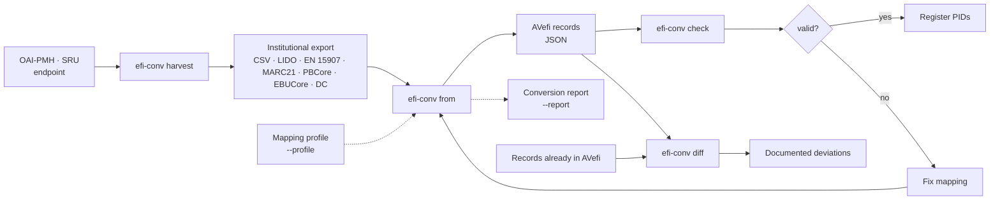
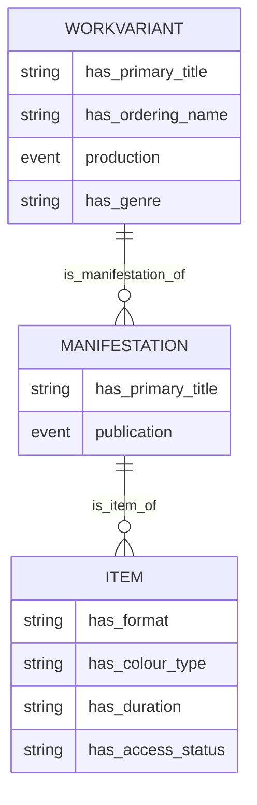
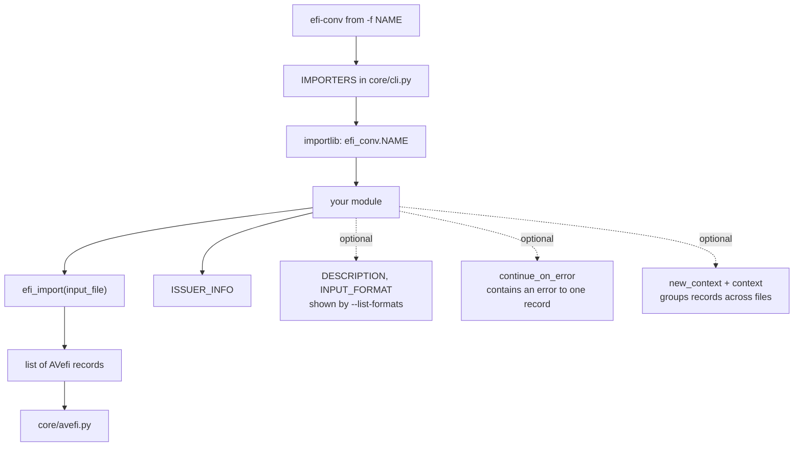

<div align="center">

# efi-conv

**Convert collection metadata to the [AVefi schema][] — and prove that nothing was lost on the way.**

[](https://opensource.org/licenses/MIT)
[](https://www.python.org/)
[][uv_install]
[](https://github.com/AV-EFI/efi-conv/pkgs/container/efi-conv)

</div>

Reference repository for creating mappings to the [AVefi schema][]. If
you consider contributing data to the [AVefi project][], that is,
registering persistent identifiers for some audio-visual material in
your collection, this may be a good place to start. Contributions are
very welcome. Feel free to fork and submit pull requests or otherwise
get in touch and let us jointly work on your mapping.

[AVefi project]: https://projects.tib.eu/av-efi/
[AVefi schema]: https://av-efi.github.io/av-efi-schema/

> **Neu hier und auf der Suche nach einer Anleitung?** Das
> [Handbuch](./handbuch/) führt auf Deutsch durch Installation,
> Konvertierung, Profile und die Eigenheiten einzelner Bestände. Diese
> README ist die technische Referenz.

**Contents** · [What it does](#what-it-does) · [Quick start](#quick-start) ·
[Commands](#commands) · [Converters](#available-converters) ·
[Profiles](#profiles) · [Harvesting](#harvesting-from-an-endpoint) ·
[Conversion report](#conversion-report) · [Comparing against AVefi](#comparing-against-avefi) ·
[Writing a converter](#writing-a-converter) · [Development](#development) ·
[Troubleshooting](#troubleshooting)

---

## What it does

A converter reads the export format of one institution and produces
records complying with the AVefi schema, ready to have persistent
identifiers registered for them. Values that cannot be converted are
never dropped in silence: they are logged, and `--report` collects them
in a machine readable protocol.



The AVefi schema describes holdings on three levels, and a converter is
expected to produce all three. A work is the film, a manifestation is
one of its versions, an item is a physical or digital copy an
institution actually holds:



Note that several source records commonly describe several copies of
the same film. A converter should recognise that and emit one work with
several items, rather than one work per copy — otherwise the
identifiers it registers describe copies rather than films, which is
the opposite of what the AVefi project is for.

---

## Quick start

### With Docker

For seasoned Docker users, here is how to run the checks against your
data in a few simple steps:

```console
$ git clone https://github.com/AV-EFI/efi-conv.git
$ cd efi-conv
$ docker-compose pull
## If that does not work run:
## $ docker-compose build
$ docker-compose run efi-conv check tests/avportal/efi_records.json
INFO efi_conv.core.check: Processing tests/avportal/efi_records.json
INFO efi_conv.core.check: All 3 records passed the checks successfully
```

The container runs as an unprivileged user whose UID and GID default to
1000, so files it writes into the mounted working directory belong to
you rather than to root. Override them at build time if your account
uses different ones:

```console
$ UID=$(id -u) GID=$(id -g) docker-compose build
```

### With uv

Everyone else should rather set up a dedicated virtual environment,
preferably using the [dependency manager UV][uv_install]:

```console
$ git clone https://github.com/AV-EFI/efi-conv.git
$ cd efi-conv
$ uv sync --no-python-downloads
$ uv run efi-conv --help
```

Convert some test data and validate the result:

```console
$ uv run efi-conv from -f avportal -o efi_records.json tests/avportal/*.xml
INFO efi_conv.avportal.avportal: Replaced name 'Dore Kleindienst-Andrée' by 'Kleindienst-Andrée, Dore'
INFO efi_conv.avportal.avportal: Replaced name 'E. Fischer' by 'Fischer, E.'
INFO efi_conv.core.from_: Processed 1 of 1 input file(s), produced 3 record(s) (1 Item, 1 Manifestation, 1 WorkVariant)
$ uv run efi-conv check efi_records.json
INFO efi_conv.core.check: Processing efi_records.json
INFO efi_conv.core.check: All 3 records passed the checks successfully
```

[uv_install]: https://docs.astral.sh/uv/getting-started/installation/

---

## Commands

```console
$ uv run efi-conv --help
Usage: efi-conv [OPTIONS] COMMAND [ARGS]...

  Convert collection metadata to the AVefi schema and check it.

Commands:
  check    Sanity check EFI_FILES and optionally remove invalid records.
  diff     Compare CANDIDATE against REFERENCE and report the deviations.
  from     Convert files from some schema into a JSON file with AVefi records.
  harvest  Fetch records from an OAI-PMH or SRU endpoint into a directory.
```

### Global options

| Option | Description |
| --- | --- |
| `--version` | Print the package version |
| `-v`, `--verbose` | Show debug output, overriding `EFI_CONV_LOGLEVEL` |
| `-q`, `--quiet` | Show errors only |

### `efi-conv from`

| Option | Description |
| --- | --- |
| `-f`, `--format` | Source data format; see [converters](#available-converters) |
| `-o`, `--output FILE` | Output file, stdout if not specified |
| `--report FILE` | Write a structured JSON report of unconvertible values |
| `--profile FILE` | Bind the converter to a [mapping profile](#profiles); required for the format converters |
| `--continue-on-error` | Skip what fails to convert and exit non-zero at the end |
| `--accept-placeholder-issuer` | Convert without naming the data provider, for trying a mapping out |
| `--allow-profile-format-mismatch` | Use a profile written for another converter, deliberately |
| `--list-formats` | List the available converters and exit |

Output is deterministic: records are ordered by category, parents
before children, then by identifier, so converting the same input twice
yields byte identical results. The input files are converted in sorted
order, so the output depends on which files were named rather than on
the order they were named in or on how the shell expanded a glob.

One invocation is one conversion, whatever the input happens to be
split into. Records describing the same film are grouped into one work
across all the files named on the command line, which is what the
harvest workflow below depends on: `efi-conv harvest` writes one file
per page, and a page boundary has nothing to do with which records
describe the same film. Converting the files one at a time instead
mints one work per file, and the resulting files cannot be used
together, because the works then carry the same identifier twice.

The run exits non-zero when it lost anything: a file that could not be
read, and a record that could not be converted. A conversion that
skipped records is not a success, however many records it did write.

#### Local identifiers

A local identifier ends up in a handle, in the addresses built from it
and in front of the people reviewing a conversion. It therefore keeps
letters and digits as they are, whatever script they are written in:
`Brücke`, `Sanitätshunde` and `白蛇伝` stay themselves. Those
characters are legal in a Handle System suffix and in an IRI; they are
not legal in a URI, so whoever builds one percent-encodes them there,
as a browser does when it displays an IRI. The same applies to a value
put into an HTTP header, or into a filename on a system that cannot
spell it.

What a URI parser would read is replaced rather than kept: the space
and `/`, `:`, `#`, `?`, `&`, `%`, `=`, `@`, `+`, `;`, `,`, `<`, `>`,
the quotes, the backslash, `|`, `^`, the brackets and braces, and the
control characters. A run of them becomes a single `_`, and `~` is
replaced too, because it marks the digest below.

Replacing loses information, and losing information would let two
different source records arrive at one identifier, which cannot be
taken back once it is registered. Whenever anything was replaced, a
short digest of the whole value is therefore appended behind `~`, so
that the two records stay apart:

| Value | Identifier |
| --- | --- |
| `FMDU-0001` | `FMDU-0001` |
| `Brücke, Die__Wicki, Bernhard__1959` | `Brücke_Die__Wicki_Bernhard__1959~fa362a56` |
| `ger:SpokenLanguage` | `ger_SpokenLanguage~09472c59` |

A value that needs no substitution gets no digest and is passed
through exactly as it came in, which is the common case for a
provider's own record identifiers. An identifier without `~` is
therefore the value itself. A value too long to be workable keeps its
first 100 characters and is completed by a digest of the whole of it,
the two separated by `~~`, which no shorter identifier can contain, so
a shortened identifier can never look like a complete one.

> [!IMPORTANT]
> This rule changed the identifiers this tool mints. Earlier versions
> passed `/`, `:`, `#`, `?` and spaces through and dropped other
> characters altogether, so an identifier minted before is not the
> identifier minted for the same record now. If you have already
> registered persistent identifiers for records produced by an earlier
> version, convert your data again and compare before registering
> anything further: with
> [`efi-conv diff`](#comparing-against-avefi) against what is in
> AVefi, and by mapping your old identifiers onto the new ones through
> `described_by.has_source_key`, which is the provider's own key and
> is recorded verbatim, unchanged by this.

### `efi-conv check`

| Option | Description |
| --- | --- |
| `-u`, `--update-schema` | Fetch the current AVefi schema from the upstream repository |
| `-r`, `--remove-invalid` | Remove invalid records, modifying the file in place |
| `--preserve-status-removed` | Accept items with access status `Removed` that carry no PID yet |
| `--accept-placeholder-issuer` | Accept records that still name the placeholder issuer |

The schema is cached in the user cache directory and a warning is
emitted once it is older than 30 days. Files are rewritten atomically,
so an interrupted run cannot truncate your data.

A file whose `described_by.has_issuer_id` is still the documented
placeholder `https://w3id.org/avefi/issuer/unspecified` does not pass.
It says that the data provider is unspecified, and no persistent
identifier may be registered for a record that says that. Naming the
provider is what [`--profile`](#profiles) is for; the check is the last
step before registration, so this is the last place it can be noticed.
`--remove-invalid` does not answer it by dropping the records: a file
emptied of everything is not a file whose data provider has been named.

### `efi-conv diff`

| Option | Description |
| --- | --- |
| `--format [markdown\|json]` | Output format of the comparison |
| `--ignore FIELD` | Ignore a top level field, repeatable |
| `-o`, `--output FILE` | Write the comparison to a file |

### `efi-conv harvest`

| Option | Description |
| --- | --- |
| `-p`, `--protocol [oai\|sru]` | Protocol the endpoint speaks |
| `-u`, `--url URL` | Base URL of the endpoint |
| `-o`, `--output DIR` | Directory to write the harvested pages to |
| `-m`, `--metadata-prefix` | OAI-PMH metadata prefix, e.g. `lido`, `marc21`, `oai_dc` |
| `--set`, `--from`, `--until` | Selective OAI-PMH harvesting |
| `--query`, `--record-schema` | SRU query in CQL and the schema to request |
| `--page-size N` | Records to request per SRU response |
| `--limit N` | Write at most N records, for trying an endpoint out |
| `--contact ADDRESS` | Contact address added to the User-Agent |
| `--delay SECONDS` | Wait between two requests (default 1) |
| `--max-retry-after SECONDS` | Give up rather than obey a longer `Retry-After` (default 300) |

`--query` has no short form: `-q` is `--quiet` on `efi-conv` itself,
and a `-q` here would swallow the next argument as a CQL query on an
OAI-PMH harvest, where no query is used at all.

A harvest that produced no records exits zero. Nothing matching the
request, and an incremental harvest whose only changes were deletions,
are both good runs. What exits non-zero is a run that failed: an
endpoint that could not be reached or read, and an SRU harvest that
did not reach the number of records the endpoint reported.

---

## Available converters

```console
$ uv run efi-conv from --list-formats
```

There are two kinds. An **institution converter** reads one
institution's export and knows whose it is, so it can be run as it
stands:

| Format | Institution | Input |
| --- | --- | --- |
| `avportal` | TIB AV-Portal | XML, in-house NTM metadata schema 2.5 |
| [`fmdu`](./src/efi_conv/fmdu/README.md) | Filmmuseum der Landeshauptstadt Düsseldorf | CSV, semicolon separated |
| [`fmdu.lido`](./src/efi_conv/fmdu/README.md) | Filmmuseum der Landeshauptstadt Düsseldorf | XML, [LIDO 1.1](./src/efi_conv/lido/README.md) |
| `mdigital.lido` | [museum-digital](./src/efi_conv/mdigital/README.md) | XML, LIDO 1.1 |
| `ddb.lido` | [Deutsche Digitale Bibliothek](./src/efi_conv/ddb/README.md) | XML, LIDO 1.1 |
| [`slub.marc21`](./src/efi_conv/slub/README.md) | SLUB Dresden | XML, MARC21 slim |

A **format converter** reads a standard rather than one institution's
export. It cannot know whose collection it is pointed at, so it ships
with a placeholder issuer and needs a [profile](#profiles):

| Format | Standard | Input |
| --- | --- | --- |
| [`en15907`](./src/efi_conv/en15907/README.md) | EN 15907, the film identification standard | XML, EFG 3.2.07 |
| [`marc21`](./src/efi_conv/marc21/README.md) | MARC21 bibliographic | XML, MARC21 slim |
| [`pbcore`](./src/efi_conv/pbcore/README.md) | PBCore 2.1 | XML |
| [`ebucore`](./src/efi_conv/ebucore/README.md) | EBUCore, EBU Tech 3293 | XML |
| [`dc`](./src/efi_conv/dc/README.md) | Unqualified Dublin Core | XML, oai_dc |

If your data is EN 15907, start there: it is the standard the AVefi
schema follows, so its work, variant, manifestation and item levels
arrive already separated instead of having to be reconstructed. Dublin
Core is the weakest of the five and exists mainly because `oai_dc` is
the one metadata prefix every OAI-PMH endpoint has to offer; each
package README says plainly where its schema does not fit.

Every LIDO converter above is a thin profile on top of the generic
[`efi_conv.lido`](./src/efi_conv/lido/README.md) package. LIDO is a
standard, so the mapping is written once and an institution supplies
its issuer information and vocabularies. If your data is LIDO, you very
probably need a profile rather than a converter.

---

## Profiles

A profile is everything that differs between data providers: the
issuer, the house vocabularies, the terms marking an event or a role.
Supplying it as a file means a conversion agreed once with a provider
can be repeated for every later delivery, unattended, and it is how a
format converter is told whose collection it is converting:

```console
$ uv run efi-conv from -f en15907 \
    --profile examples/profiles/filmarchiv-musterstadt.en15907.toml \
    -o efi_records.json export.xml
```

The document is JSON or TOML; `examples/profiles/` holds both. Anything
under `settings` names a field of that converter's profile class, and a
name the class does not have is an error rather than something to
ignore — a misspelt vocabulary would otherwise look like a working
profile and quietly lose every value it was meant to map.

One thing to know before writing one: **a profile replaces the
vocabularies a converter ships with, it does not add to them.** A
profile that changes only the issuer and omits, say,
`film_work_type_terms` falls back to the class defaults, which know
nothing of one institution's carrier vocabulary.

→ [Handbuch, Kapitel 3](./handbuch/03-profile.md) walks through writing
one, with the settings listed and that trap spelled out.


## Harvesting from an endpoint

Where a provider offers OAI-PMH or SRU, records can be fetched into a
directory and converted from there, so that a better mapping can be run
again over the same material without asking the endpoint twice:

```console
$ uv run efi-conv harvest --protocol oai-pmh \
    --endpoint https://example.org/oai --metadata-prefix oai_dc -o harvested/
$ uv run efi-conv from -f dc --profile provider.toml -o efi_records.json harvested/*.xml
```

The harvester follows resumption tokens and waits between requests: an
OAI endpoint usually belongs to an institution that has other things to
do with it. `--set` and `--from` restrict what is fetched.

→ [Handbuch, Kapitel 6](./handbuch/06-ernten.md)


## Conversion report

Values that cannot be converted are never dropped silently. They are
logged, and `--report` additionally collects them in a machine readable
file whose format is documented in
[`report_schema.json`](./src/efi_conv/core/report_schema.json):

```console
$ uv run efi-conv from -f fmdu.lido -o efi_records.json \
    --report report.json tests/lido/sample_data.xml
```

Each entry carries a severity, the message, the source file, the record
id, the source and target field and the raw value, so that anything
reported can be found again in the system it came from.

Severity is used consistently. `info` records a documented decision,
`warning` says that information was not transferred, and `error` says
that a record failed. A value nobody can read is therefore a warning
rather than an error: the field is left unset and the record is kept,
because discarding it would cost the work, every manifestation and
every item derived from it.

`summary.records_skipped` counts the source records left out of the
output and `summary.files_unrecognised` the input files holding no
record the converter recognises. Both are what the exit code of
`efi-conv from` reflects, so a pipeline does not have to read message
text to tell a complete run from a lossy one.

The AVefi schema is fetched from a branch rather than from a release,
so the report records a hash of the document a conversion was checked
against. That makes it possible to reproduce a conversion later, or at
least to tell that the schema has moved since.

→ [Handbuch, Kapitel 4](./handbuch/04-bericht-lesen.md) reads a real
report end to end.


## Comparing against AVefi

To find out what a conversion changes with respect to data already held
in AVefi, compare the two files. Records are matched on a shared
registered identifier where both sides carry one and on a shared local
identifier otherwise, so the order of the files does not matter and two
exports of one collection can be compared even though the local
identifiers derived from them differ. Entries of a list are paired up,
so that a single altered attribute is not reported as a whole object
being replaced:

```console
$ uv run efi-conv diff reference.json efi_records.json
```

The command exits non-zero when anything present in the reference is
missing from the candidate, so it can be used in a pipeline. `--ignore`
drops a top level field from the comparison, which is what makes it
usable across a change to the identifier scheme.

→ [Handbuch, Kapitel 5](./handbuch/05-pruefen-und-vergleichen.md)


## Writing a converter

Add new converters as modules within the [efi_conv
package](./src/efi_conv). Then add the module as another choice to the
`IMPORTERS` list in [cli.py](./src/efi_conv/core/cli.py) to make it
accessible from the command line.



What your module has to provide:

| Name | Required | Purpose |
| --- | --- | --- |
| `efi_import(input_file)` | yes | Returns a list of AVefi records |
| `ISSUER_INFO` | yes | `has_issuer_id` and `has_issuer_name` for `described_by` |
| `DESCRIPTION` | no | One line shown by `--list-formats` |
| `INPUT_FORMAT` | no | Expected input, shown by `--list-formats` |
| `main(argv=None)` | no | Lets the converter be run as `python -m efi_conv.NAME`; delegate to `efi_conv.core.cli.run_converter_main` |
| `PROFILE` | no | The profile `efi_import` uses, which `--profile` replaces |
| `continue_on_error` parameter | no | Lets `from` skip a single bad record instead of the whole file |
| `context` parameter and `new_context()` | no | Lets `from` group the records of all its input files into one conversion |
| `PROFILE_CLASS` and `convert(input_file, profile, continue_on_error)` | no | Lets the converter be bound to a [profile](#profiles) |

A converter that shares works between records opts into the second of
these. `efi-conv from` calls `new_context()` once per invocation and
hands the result to every input file, so that one film described in
two files becomes one work rather than two carrying the same
identifier. `efi_import(input_file)` without a context keeps
converting the one file on its own, which is what
`python -m efi_conv.NAME` and the direct API do.

Register what a record contributes inside `context.attempt()`. A
record that fails halfway would otherwise leave its work in the
context but not in the output, and the next record with the same key
would find the work known, emit nothing, and refer to a work nobody
wrote.

Before writing one, check what is already there. The shared layer in
[`core`](./src/efi_conv/core) carries the parts every converter needs:
`normalise.py` for dates, durations and titles, so that two converters
cannot arrive at different AVefi values for the same source
expression; `records.py` for identifiers, titles and the sharing of a
work between the copies describing it; `xmlrecords.py` for streaming
records out of a document whatever wraps them. If your data is a
standard somebody else also holds their collection in, a profile on an
existing converter is very likely the right answer.

Because the value of `-f` is resolved as a module path below
`efi_conv`, a converter nested inside an institution package is
registered under its dotted name — `fmdu.lido` resolves to
`efi_conv.fmdu.lido`.

Unless you already have a suitable python parser for your data, check
out whether the [xsData][xsdata] or similar projects can help you
there. In fact, the [avportal module relies on xsData for
parsing](./src/efi_conv/avportal/README.md) as has been briefly
documented, as does the [lido module](./src/efi_conv/lido/README.md).

Say so when a file holds nothing you recognise. `xmlrecords.py` does
that for you when it finds no record element; a converter reading
another kind of file calls
`efi_conv.core.report.report_nothing_recognised` itself, at the point
where it went looking. `efi-conv from` reads that report entry rather
than concluding anything from a run that produced no records, so a
converter that stays silent here tells a pipeline that the delivery
held no films.

The actual mapping is the tedious part. See
[avportal.py](./src/efi_conv/avportal/avportal.py) for the kind of work
you are letting yourself in for, and consult the [AVefi schema
documentation][AVefi schema]. Two things are worth getting right from
the start: report what you cannot map instead of dropping it, and
decide deliberately whether a source record is a work or a copy of one.

[xsdata]: https://xsdata.readthedocs.io/

---

## Development

If you consider hacking on this package and even making a pull request
at some point, it is advisable to install the pre-commit hooks
configured on this repository. This way, some quality checks and coding
style guide lines will be enforced right from the beginning, which will
make merging your code much easier eventually. The pre-commit package
is not part of the package's virtual environment and needs to be
installed globally instead, because the hooks are executed
automatically on every `git commit`:

```console
$ pipx install pre-commit
$ pre-commit install
```

That's all. Feel free to start hacking!

```console
$ uv sync --group dev --locked     # install with development dependencies
$ uv run coverage run -m pytest    # run the test suite
$ uv run coverage report -m        # coverage summary
$ uv run ruff check                # lint
$ uv run ruff format --diff        # formatting check
```

Ruff enforces a line length of 79 characters and the numpy docstring
convention; `generated/` is excluded from linting. The test suite runs
offline: the AVefi schema is committed as a fixture, so no network
access is needed on a cold run. CI runs every pre-commit hook and tests
Python 3.11 through 3.14 on Linux plus a Windows runner, because data
providers do run this tool where the default encoding is not UTF-8.

---

## Troubleshooting

**The first run wants network access.** `efi-conv check` downloads the
AVefi schema into the user cache directory on first use. Refresh it
deliberately with `efi-conv check --update-schema`.

**Far fewer records than the export holds.** Almost always the work
type vocabulary. The report says which values made the decision;
`film_work_type_terms` is where they belong, and a profile replaces
that list rather than adding to it.

**A file fails to convert and the run stops.** That is the default, so
that a broken export does not pass unnoticed. Use `--continue-on-error`
to skip it, record it in the report and carry on; the command still
exits non-zero at the end.

**The run exits non-zero although records were written.** Something was
lost: `summary.records_skipped` in the report counts the source records
that could not be converted, and the entries say why.

**A document is refused because it declares XML entities.** An entity
is expanded against the document type declaration, and a record is
converted on its own, away from it — the reference and the rest of the
text would silently disappear, which is worse than stopping. Resolve
the entities first, for instance with `xmllint --noent export.xml >
resolved.xml`. External entities are never fetched.

**Two records that are the same film got two works.** The grouping key
is the primary title, the director and the production date, and a key
that comes down to the title alone does not group: two undated films
called `Werbefilm` would otherwise become one work with one identifier,
which no later correction can undo. Two works minted for one film can
be merged afterwards; the report names every record this applies to.

**`efi-conv check` reports unresolvable references.** A manifestation
or item points at a parent that is not in the same file. Convert the
whole export at once, or pass all the files to a single invocation.

**The conversion is refused because of the placeholder issuer.** A
format converter cannot know whose collection it is pointed at, and an
ISIL must not be guessed, so it will not convert until a
[profile](#profiles) names the data provider.

→ [Handbuch, Kapitel 8](./handbuch/08-fehlerbehebung.md) covers these
with the commands to diagnose them.

---

## About the project

AVefi — *Automatisiertes Verbundsystem für audiovisuelle Bestände über
einheitliche Film-Identifikatoren* — is building a central, PID based
union system for audio-visual holdings, so that one film can be named
unambiguously across collection boundaries.

**Project partners**

- Leibniz Information Centre for Science and Technology (TIB), Hannover
- Deutsche Kinemathek — Museum für Film und Fernsehen (SDK), Berlin
- Gesellschaft für wissenschaftliche Datenverarbeitung mbH Göttingen (GWDG)
- Filmmuseum der Landeshauptstadt Düsseldorf (FMDU)

**What was commissioned, and what came with it**

The commission was one importer: LIDO for the Filmmuseum der
Landeshauptstadt Düsseldorf, which is `efi_conv.lido` together with the
`efi_conv.fmdu` profile.

Everything else here grew out of that and is included. The mapping had
to be written generically to be worth having, so it serves
museum-digital and the Deutsche Digitale Bibliothek as well. The format
converters for EN 15907, MARC21, PBCore, EBUCore and Dublin Core follow
the same shape, and `slub.marc21` is what a library's profile looks like
on top of one. `harvest` fetches the records, and `check` and `diff` are
what make a conversion something one can verify rather than believe —
a converter is not worth much until somebody can prove what it did to
the data.

**Funding**

Funded by the Deutsche Forschungsgemeinschaft (DFG, German Research
Foundation) — project number **517778207**.

→ [GWDG project page](https://gwdg.de/projects/avefi/) ·
[TIB project page](https://projects.tib.eu/av-efi/) ·
[contact@av-efi.net](mailto:contact@av-efi.net)

---

## License

Released under the [MIT License](./LICENSE).
