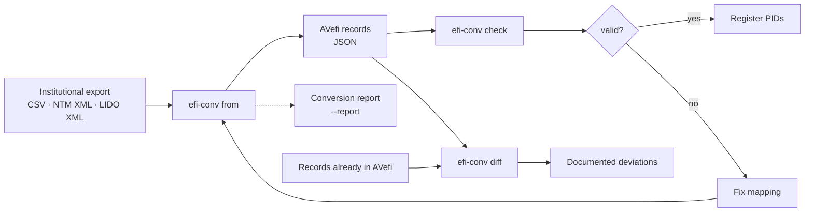
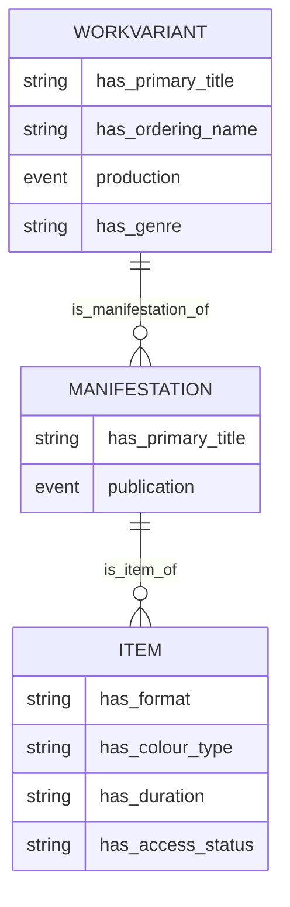
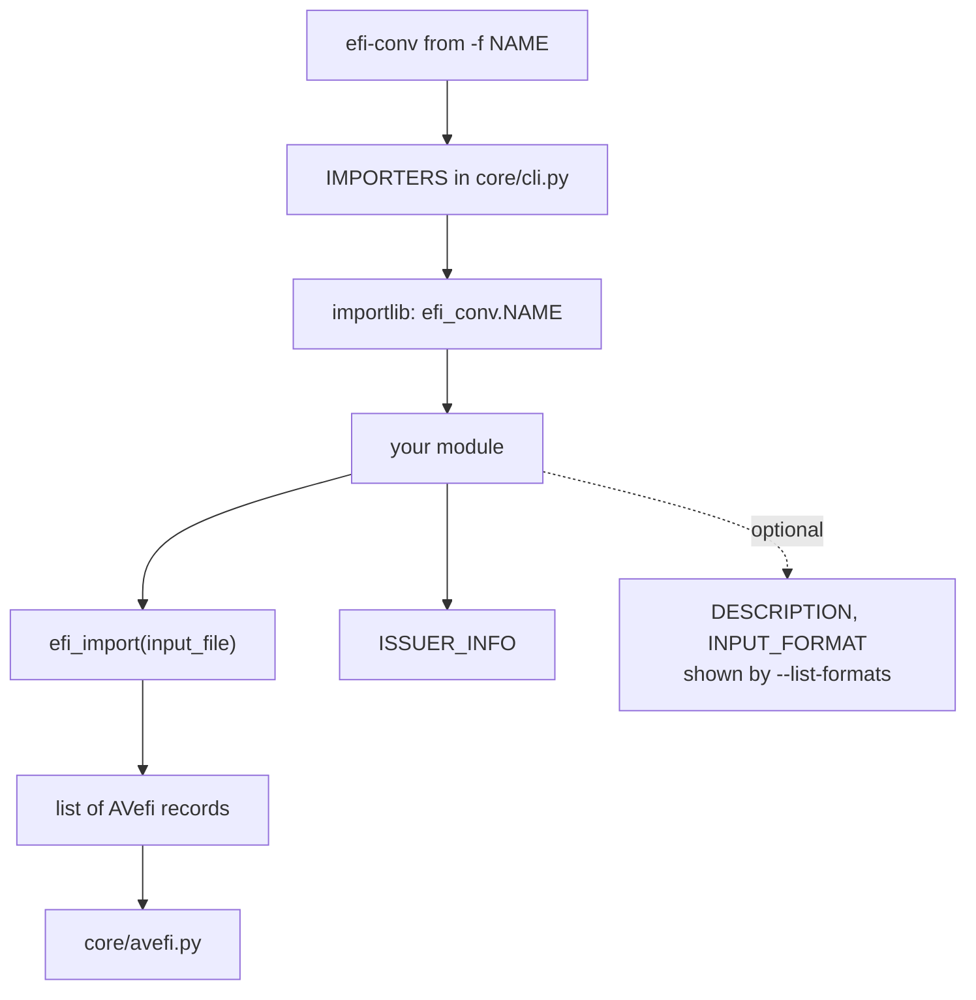

License: MIT
[](https://opensource.org/licenses/MIT)

# efi-conv

Reference repository for creating mappings to the [AVefi schema][]. If
you consider contributing data to the [AVefi project][], that is,
registering persistent identifiers for some audio-visual material in
your collection, this may be a good place to start. Contributions are
very welcome. Feel free to fork and submit pull requests or otherwise
get in touch and let us jointly work on your mapping.

[AVefi project]: https://projects.tib.eu/av-efi/
[AVefi schema]: https://av-efi.github.io/av-efi-schema/

## What this tool does

A converter reads the export format of one institution and produces
records complying with the AVefi schema, ready to have persistent
identifiers registered for them. Values that cannot be converted are
never dropped in silence: they are logged, and `--report` collects them
in a machine readable protocol.



The AVefi schema describes holdings on three levels, and a converter is
expected to produce all three. A work is the film, a manifestation is
one of its versions, an item is a physical or digital copy an
institution actually holds:



Note that several source records commonly describe several copies of
the same film. A converter should recognise that and emit one work with
several items, rather than one work per copy — otherwise the
identifiers it registers describe copies rather than films, which is
the opposite of what the AVefi project is for.

## Usage example

The check module included in this package allows you to validate
generated JSON files that are supposed to comply with the
[AVefi schema][]. Simply clone the repository and either use
[docker-compose](https://docs.docker.com/compose/) or install the
package in a virtual environment in editable mode. The latter can be
done in the traditional way using pip but it is highly recommended to
use the dependency manager [UV][uv_install] instead, especially if you
consider contributing and might need to add dependencies at some
point.

For seasoned Docker users, here is how to run the checks against your
data just a few simple steps:

```console
$ git clone https://github.com/AV-EFI/efi-conv.git
## [...]
$ cd efi-conv
$ docker-compose pull
## If that does not work run:
## $ docker-compose build
## Then:
$ docker-compose run efi-conv check tests/avportal/efi_records.json
INFO efi_conv.core.check: Processing tests/avportal/efi_records.json
INFO efi_conv.core.check: All 3 records passed the checks successfully
```

Everyone else should rather setup a dedicated virtual environment,
preferably using the [dependency manager UV][uv_install].

Here is a more complete usage example showing how to convert some test
data:

```console
$ git clone https://github.com/AV-EFI/efi-conv.git
## [...]
$ cd efi-conv
$ uv sync --no-python-downloads
## [...]
$ uv run efi-conv --help
Usage: efi-conv [OPTIONS] COMMAND [ARGS]...

  Convert collection metadata to the AVefi schema and check it.
  [...]

Options:
  --version      Show the version and exit.
  -v, --verbose  Show debug output (overrides EFI_CONV_LOGLEVEL).
  -q, --quiet    Show errors only (overrides EFI_CONV_LOGLEVEL).
  --help         Show this message and exit.

Commands:
  check  Sanity check EFI_FILES and optionally remove invalid records.
  diff   Compare CANDIDATE against REFERENCE and report the deviations.
  from   Convert files from some schema into a JSON file with AVefi records.
$ uv run efi-conv from --help
Usage: efi-conv from [OPTIONS] [INPUT_FILES]...

  Convert files from some schema into a JSON file with AVefi records.

Options:
  --list-formats                     List available converters with their
                                     input format and exit.
  -f, --format [avportal|fmdu|fmdu.lido]
                                     Source data format.  [required]
  -o, --output FILE                  Output file (stdout if not specified).
  --report FILE                      Write a structured JSON report of
                                     unconvertible values.
  --continue-on-error                Skip input files that fail to convert
                                     instead of aborting.
  --help                             Show this message and exit.
$ uv run efi-conv from -f avportal -o efi_records.json tests/avportal/*.xml
INFO efi_conv.avportal.avportal: Replaced name 'Dore Kleindienst-Andrée' by 'Kleindienst-Andrée, Dore'
INFO efi_conv.avportal.avportal: Replaced name 'E. Fischer' by 'Fischer, E.'
$ uv run efi-conv check tests/avportal/efi_records.json
INFO efi_conv.core.check: Processing tests/avportal/efi_records.json
INFO efi_conv.core.check: All 3 records passed the checks successfully
```

Values that cannot be converted are never dropped silently. They are
logged, and `--report` additionally collects them in a machine readable
file whose format is documented in
[`report_schema.json`](./src/efi_conv/core/report_schema.json):

```console
$ uv run efi-conv from -f fmdu.lido -o efi_records.json \
    --report report.json tests/lido/sample_data.xml
$ uv run efi-conv check efi_records.json
```

To find out what a conversion changed with respect to data already held
in AVefi, compare the two files. The command exits non-zero when
anything present in the reference is missing from the candidate, so it
can be used in a pipeline:

```console
$ uv run efi-conv diff reference.json efi_records.json
```

[uv_install]: https://docs.astral.sh/uv/getting-started/installation/

## Developer note

If you consider hacking on this package and even making a pullrequest
at some point, it is advisable to install the pre-commit hooks
configured on this repository. This way, some quality checks and
coding style guide lines will be enforced right from the beginning
which will make merging your code much easier, eventually. The
pre-commit package is not part of the package's virtual environment
and needs to be installed globally instead. This is because the hooks
are executed automatically on every `git commit`; the hooks themselves
are configured for this repository only, of course. So, here is one
way to set things up:

```console
$ pipx install pre-commit
$ pre-commit install
```

That's all. Feel free to start hacking!

Add new converters as modules within the [efi_conv
package](./src/efi_conv). Then, add this module as another choice to
the `IMPORTERS` list in [cli.py](./src/efi_conv/core/cli.py) to make it
accessible from the command line. Note that the value of `-f` is
resolved as a module path below `efi_conv`, so a nested converter is
registered under its dotted name, as `fmdu.lido` is. Take care that the
module provides `.module_name:efi_import` function similar to what the
avportal module does, along with `ISSUER_INFO`; `DESCRIPTION` and
`INPUT_FORMAT` are picked up by `efi-conv from --list-formats`.

If your data is LIDO, you probably do not need a new converter at all:
[`efi_conv.lido`](./src/efi_conv/lido/README.md) maps the standard, and
an institution is described by a `LidoProfile` carrying its issuer
information and vocabularies. See
[`fmdu/lido.py`](./src/efi_conv/fmdu/lido.py) for a worked example.

Unless you already have a suitable python parser for your data, check
out whether the [xsData][xsdata] or similar projects can help you
there. In fact, the [avportal module relies on xsData for
parsing](./src/efi_conv/avportal/README.md) as has been briefly
documented, as does the [lido module](./src/efi_conv/lido/README.md).

A converter is wired into the package like this:



Because the value of `-f` is resolved as a module path below
`efi_conv`, a converter nested inside an institution package is
registered under its dotted name — `fmdu.lido` resolves to
`efi_conv.fmdu.lido`.

The actual mapping is the tedious part. See
[avportal.py](./src/efi_conv/avportal/avportal.py) for the kind of
work you are letting yourself in for. Also consult the [AVefi schema
documentation][AVefi schema].

[xsdata]: https://xsdata.readthedocs.io/
