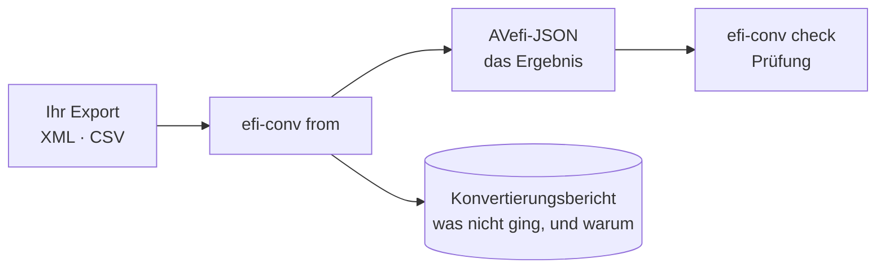
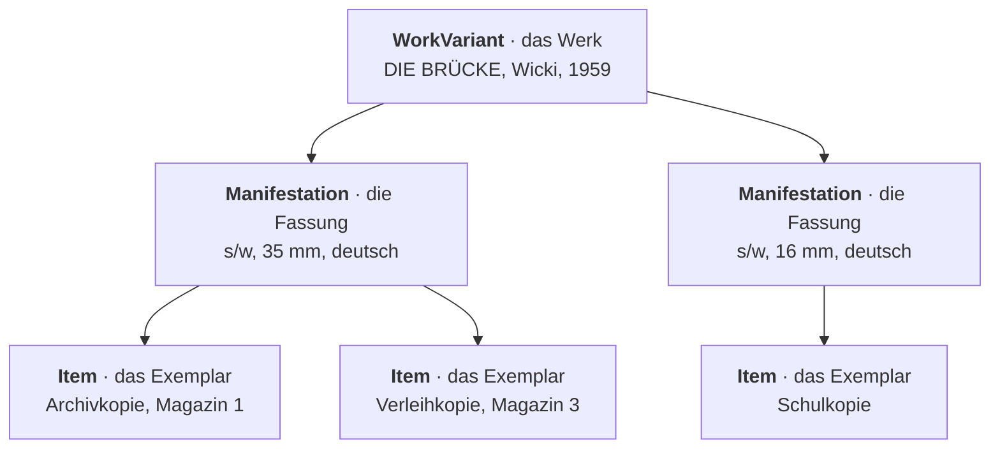

# 1 · Einstieg

## Was das Werkzeug tut

`efi-conv` liest den Export Ihres Systems und schreibt eine JSON-Datei im
AVefi-Schema. Diese Datei ist das Ergebnis.

> [!NOTE]
> Die Datei wird **nicht** automatisch irgendwohin hochgeladen. Was damit
> geschieht, entscheiden Sie und die Projektstelle gemeinsam.



## Installation

Sie brauchen [uv](https://docs.astral.sh/uv/getting-started/installation/).
Danach:

```console
$ git clone https://github.com/AV-EFI/efi-conv
$ cd efi-conv
$ uv sync
$ uv run efi-conv --help
```

Wer lieber Docker benutzt, findet die Variante in der
[README](../README.md#with-docker).

## Die erste Konvertierung

Zuerst nachsehen, welcher Konverter zu Ihren Daten passt:

```console
$ uv run efi-conv from --list-formats
```

Die Ausgabe nennt zu jedem Konverter das Eingabeformat, die Einrichtung und
ob ein Profil nötig ist. Dann:

```console
$ uv run efi-conv from -f fmdu.lido -o ergebnis.json export.xml
```

Und immer als zweiten Schritt:

```console
$ uv run efi-conv check ergebnis.json
```

`check` sagt Ihnen, ob die Datei dem Schema entspricht. Sie hat Regeln, die
über die reine Form hinausgehen — sie merkt zum Beispiel, wenn ein Exemplar
als „entfernt" markiert ist, obwohl es nie eine PID hatte.

## Was Sie danach in der Hand haben

Eine JSON-Datei mit drei Sorten von Datensätzen:

- **WorkVariant** — das Werk, also der Film als solcher
- **Manifestation** — die Fassung, also eine bestimmte Ausprägung davon
- **Item** — das Exemplar, also das Stück in Ihrem Magazin



Mehrere Exemplare desselben Films teilen sich ein Werk. Das ist Absicht: eine
PID pro Film, nicht eine pro Rolle im Regal.

## Wie es weitergeht

Wenn der Konverter für Ihr Haus noch nicht existiert, brauchen Sie meist
keinen neuen, sondern ein → [Profil](03-profile.md). Wenn Ihre Daten LIDO
sind, gilt das fast sicher.

---

[Übersicht](README.md) · [2 · Konvertieren](02-konvertieren.md) →
