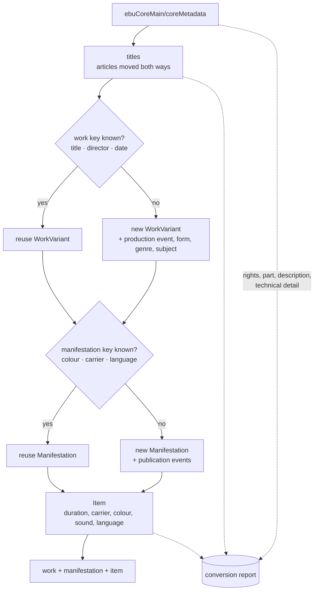

# Import from EBUCore

This package maps [EBUCore](https://tech.ebu.ch/publications/tech3293)
(EBU Tech 3293, version 1.10) records to the AVefi schema. EBUCore is a
standard, so the traversal of a document is the same for every data
provider; everything provider specific — the issuer information and the
controlled vocabularies behind the `typeLabel` attributes — is supplied
through an `EbucoreProfile`. A converter for a new data provider is
therefore a profile, not a new mapping.

## How well does a broadcast schema fit an archival film model?

Not particularly well, and it is better to say so than to paper over
it. EBUCore was written to describe broadcast assets: one editorial
object, the formats it exists in, and a great deal of detail about how
it is encoded, transmitted, scheduled and cleared. AVefi is built on
the FIAF distinction between the film as a work, the version of it that
was published, and the physical or digital copy an archive holds.
Neither model is a refinement of the other.

Three consequences follow.

*The hierarchy has to be inferred rather than read off.* EBUCore has no
work, no manifestation and no item. What it has is `coreMetadata` plus
one or more `format` elements. This converter reads the editorial
content of `coreMetadata` — titles, creators, subjects, genre,
production date and place — as the work, the publication history as the
manifestation, and the carrier described by `format` as the item. That
is a defensible reading, but it is a reading: an EBUCore record that
describes several carriers at once cannot be split into several items
by this mapping, and an EBUCore record that is really a work level
catalogue entry will still produce an item.

*The grouping is the mapping's own decision.* Because a broadcaster
exports one record per asset, the film print and its transfer arrive as
two unrelated records. AVefi identifiers are only worth registering if
both end up under one work, so works and manifestations are shared
across the records of a run according to the profile key. Where the
titles or the production year of the two records disagree, the grouping
silently fails to see that they belong together — the usual price of
key based grouping, and the reason `work_key_fields` is configurable.

*Most of EBUCore has no AVefi target at all.* Codecs, bit rates,
raster and sampling parameters, timecode and metadata tracks, loudness,
audio objects and packs, HDR metadata, rights and clearance flags,
planning, audience ratings, artefacts, animals, props, costumes, food,
emotions, actions and text lines: none of it has a home in AVefi, and
inventing one would be worse than leaving it behind. The mapping
therefore reports what it does not transfer, per record, so that the
conversion report is an honest account of the distance between the two
schemas rather than an afterthought. Anyone converting a real EBUCore
export should read the report before deciding that the AVefi records
are a sufficient substitute for it.

The upshot: EBUCore to AVefi is a lossy projection from an asset
management schema onto a cataloguing schema. It is useful for getting
holdings into AVefi and registering identifiers for them. It is not a
round trip, and this package does not pretend otherwise.

## The issuer is not part of the format

EBUCore says who provided the metadata (`metadataProvider`), but AVefi
needs the institution the records are issued by, identified by its
ISIL. That is a property of the data provider, not of the format, and
guessing an ISIL for a real institution would be worse than admitting
that it is unknown. The shipped profile therefore carries a documented
placeholder:

```python
ISSUER_INFO = {
    "has_issuer_id": "https://w3id.org/avefi/issuer/unspecified",
    "has_issuer_name": "Unspecified data provider",
}
```

The converter reports once per input file, at warning level, that the
placeholder is still in place. Replace it with the ISIL and name of the
holding institution — either by passing a profile of your own to
`efi_conv.ebucore.mapping.efi_import`, or in a thin institution module
alongside `efi_conv.fmdu.lido` — before the records are used.

## How a record is mapped



[`MAPPING.md`](MAPPING.md) states rule by rule what goes where. It is
rendered from the `MAPPING_RULES` table in `mapping.py`, and a test
fails when the two drift apart.

## What EBUCore says and AVefi does not take

`ebucore:description` is a synopsis of the content. AVefi has no
description field at any level, and an item note describes the copy
rather than the film, so the value is reported with its text instead
of being written somewhere it does not belong. The PBCore, Dublin Core
and EN 15907 converters answer the same question the same way.

`ebucore:rights` and `ebucore:part` have no AVefi counterpart either
and are reported in full.

An `ebucore:isPartOf` names a record in the source system. Where the
same run converts that record, the relation becomes `is_part_of` on
the work and points at the work the related record produced. Where it
does not, the relation is reported and not transferred: AVefi rejects
a local reference that resolves to no record of the same set, and a
converter emitting one would have the whole work discarded by the
checks. Convert the related records in the same run to keep the link.

## Durations

EBUCore expresses a duration in four alternative ways, and all four
occur in the wild:

| EBUCore | Handling |
| --- | --- |
| `normalPlayTime` | `xs:duration`, converted directly |
| `timecode` | hours, minutes and seconds are used; the frame count is reported, because `ISODurationInHours` cannot express it |
| `editUnitNumber` | divided by the `editRate` and its correction factor; without an `editRate` the value has no scale and is unconvertible |
| `duration` | free text, read by the shared duration rules |

## Structure

| Module | Purpose |
| --- | --- |
| `__init__.py` | The module interface: `DESCRIPTION`, `INPUT_FORMAT`, `ISSUER_INFO`, `efi_import`, `main` |
| `mapping.py` | Document traversal, the declarative mapping table and the mapping itself |
| `profile.py` | Provider specific configuration and the shipped vocabularies |
| `generated/` | xsdata dataclasses generated from the EBUCore XSD |

Date, duration and title normalisation is not an EBUCore concern and
lives in `efi_conv.core.normalise`, so that every converter arrives at
the same AVefi value for the same source expression.

## Records in a document

A document may hold a single `ebuCoreMain` element, any number of them
under a wrapper element of the provider's choosing, or an OAI-PMH
harvest with the records inside an envelope. All three work: records
are located by element name and streamed one at a time through
`efi_conv.core.xmlrecords`, so memory use does not depend on the size
of the export.

## Regenerating the parser

The input parser has been auto generated from the official EBUCore
schema courtesy of the [xsData project][xsdata]. Run in this directory:

```console
$ curl -o /tmp/ebucore.xsd \
    https://raw.githubusercontent.com/ebu/ebucore/master/EBUCore.xsd
$ uv run xsdata generate --include-header --unnest-classes \
    --relative-imports --docstring-style NumPy \
    --package generated.ebucore_1_10 \
    /tmp/ebucore.xsd
```

The result is large — roughly 266 classes — because EBUCore covers the
whole audio definition model as well as the descriptive metadata. Only
a small part of it is reachable from this mapping; the rest is parsed
and reported rather than mapped.

## Parser hardening

The parser is configured explicitly rather than with the defaults,
because the input arrives from partner institutions:

```python
ParserConfig(
    process_xinclude=False,
    load_dtd=False,
    fail_on_unknown_properties=False,
    fail_on_unknown_attributes=False,
)
```

DTD loading and XInclude processing are off, so a document cannot pull
in external content. Unknown properties and attributes are tolerated,
because EBUCore exports in the wild carry local extensions that must
not abort a conversion.

[xsdata]: https://xsdata.readthedocs.io/
