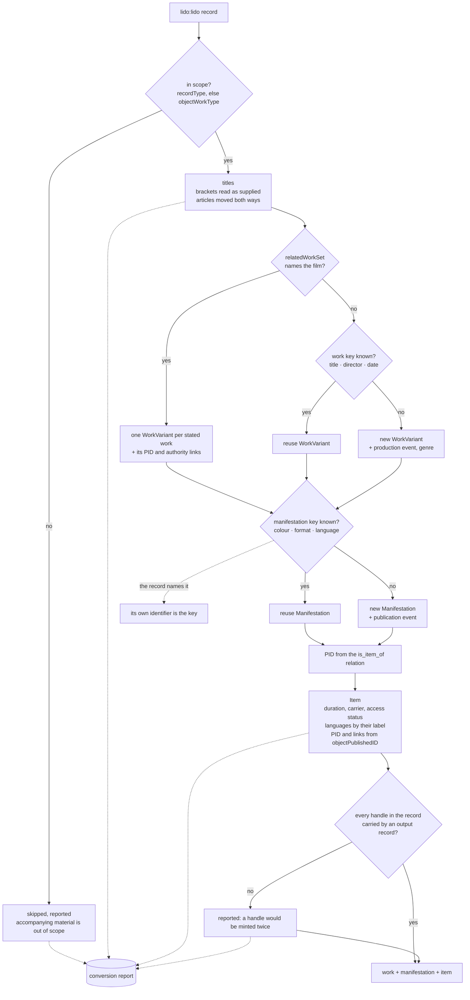

# Import from LIDO

This package maps [LIDO](https://lido-schema.org/) records to the AVefi
schema. LIDO is a standard, so the traversal of the document is the same
for every data provider; everything institution specific — issuer
information and the vocabularies used inside the LIDO terms — is
supplied through a `LidoProfile`. A converter for a new data provider is
therefore a profile, not a new mapping.

`efi_conv.fmdu.lido` is the profile for the Filmmuseum der
Landeshauptstadt Düsseldorf and doubles as the worked example.

## How a record is mapped



## Identifiers

A record states three kinds of identifier and they are not in the same
place. `objectPublishedID` is the **copy's**, because a LIDO record
describes one object and the object is the copy. The **work** and the
**manifestation** are named in the relations the record has to them:
`relatedWorkSet` with the profile's `related_work_rel_terms` carries the
work's handle and its authority links, one with
`manifestation_rel_terms` carries the manifestation's.

Which identifier of a related record is which follows from what the
record says about it and not from its position, LIDO ordering nothing:
the one whose `lido:source` names AVefi is the AVefi identifier, one
naming another authority becomes `same_as`, and what is left is the
provider's own key. The handle prefix is not the criterion — AVefi will
register under more than one — and is used only where a record states
no source at all.

A handle is always added **beside** the local identifier and never in
front of it. `is_item_of` and `is_manifestation_of` refer to a record by
its first identifier, so a PID put first would leave every reference
pointing at nothing.

Losing a handle is expensive — one cannot be withdrawn — and silent: the
run succeeds and the output validates. The conversion therefore compares
its own input and output and reports any handle the record states that
no record derived from it carries, naming the relation it stood under.
That is usually a term missing from the profile.

Grouping is by what the provider states wherever it states anything.
Copies of one manifestation are one manifestation because the record
names it, whatever else the two records say about colour, format and
language; the derived key is the fallback for a copy that names none.
Deriving it in both cases produced two manifestations carrying one
identifier between them, which `efi-conv check` rejects.

Grouping matters: several LIDO records commonly describe several copies
of one film. Emitting a work per record would register identifiers for
copies rather than for films. The work and manifestation keys are
configured in the profile and can be switched off with
`work_key_fields=()` for an export that is genuinely item-level.

Grouping stops where the key stops identifying a film. When the
director and the date are missing, the key comes down to the title
alone, and two untitled or generically titled films would become one
work with one identifier. Such a key does not group: the record keeps
a work of its own and the decision is reported, because two works
minted for one film can be merged afterwards, while one identifier
registered for two films cannot be taken back.

## Structure

| Module | Purpose |
| --- | --- |
| `normalise.py` | Date, duration and title rules; no LIDO knowledge, unit tested in isolation |
| `mapping.py` | Document traversal, the declarative mapping table and the mapping itself |
| `profile.py` | The institution specific configuration |
| `generated/` | xsdata dataclasses generated from the LIDO XSD |

The mapping table in `mapping.py` is the single declaration of what goes
where; [`MAPPING.md`](MAPPING.md) is rendered from it, and a test fails
when the two drift apart.

## Regenerating the parser

The input parser has been auto generated from the official LIDO 1.1
schema courtesy of the [xsData project][xsdata].

LIDO imports the full GML schema for the optional `lido:gml` element,
which carries geographic coordinates. Generating from it unmodified
produces roughly 43 000 lines of GML bindings — and fails outright with
a circular dependency error unless the whole schema is flattened into a
single module. Only three lines of the LIDO schema reference GML at all,
and none of them is relevant for holdings metadata about film, so the
import is replaced by a lax wildcard before generating. The bindings
then come to about 6 000 lines, comparable to the AV-Portal module.

Run in this directory:

```console
$ curl -o /tmp/lido-v1.1.xsd https://lido-schema.org/schema/v1.1/lido-v1.1.xsd
$ python - <<'PY'
import pathlib

source = pathlib.Path("/tmp/lido-v1.1.xsd")
schema = source.read_text(encoding="utf-8")
schema = schema.replace(
    '\t<xs:import namespace="http://www.opengis.net/gml"'
    ' schemaLocation="http://schemas.opengis.net/gml/3.1.1/base/gml.xsd"/>\n',
    "",
)
schema = schema.replace(
    '\t\t\t<xs:element ref="gml:Point" minOccurs="0" maxOccurs="unbounded"/>\n'
    '\t\t\t<xs:element ref="gml:LineString" minOccurs="0" maxOccurs="unbounded"/>\n'
    '\t\t\t<xs:element ref="gml:Polygon" minOccurs="0" maxOccurs="unbounded"/>',
    '\t\t\t<xs:any namespace="##other" processContents="lax"'
    ' minOccurs="0" maxOccurs="unbounded"/>',
)
pathlib.Path("/tmp/lido-v1.1-nogml.xsd").write_text(schema, encoding="utf-8")
PY
$ uv run xsdata generate --include-header --unnest-classes \
    --relative-imports --docstring-style NumPy \
    --package generated.lido_1_1 \
    /tmp/lido-v1.1-nogml.xsd
```

The consequence is documented rather than hidden: geographic
coordinates given as GML inside `lido:place/lido:gml` are parsed as
opaque elements and are not mapped. Place names, which is what AVefi
records, come from `lido:namePlaceSet` and are unaffected.

## Parser hardening

The parser is configured explicitly rather than with the defaults,
because the input arrives from partner institutions:

```python
ParserConfig(
    process_xinclude=False,
    load_dtd=False,
    fail_on_unknown_properties=False,
    fail_on_unknown_attributes=False,
)
```

DTD loading and XInclude processing are off, so a document cannot pull
in external content. Unknown properties and attributes are tolerated,
because LIDO exports in the wild carry local extensions that must not
abort a conversion.

[xsdata]: https://xsdata.readthedocs.io/
