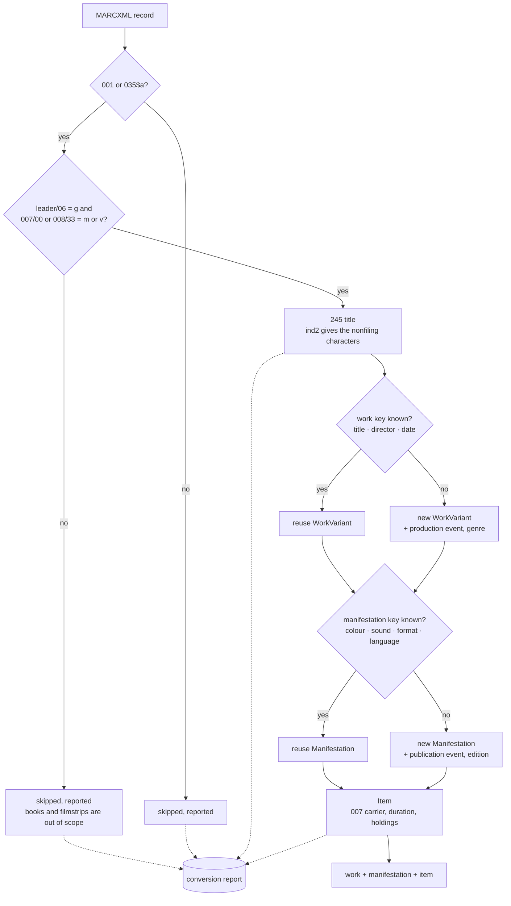

# Import from MARC21-XML

This package maps [MARC21][marc] bibliographic records, serialised as
[MARCXML][marcxml], to the AVefi schema. MARC21 is a standard, so the
traversal of a record is written once; MARC *practice* is not a
standard, so everything an individual library or archive does
differently is configured in a `Marc21Profile`. A converter for a new
data provider is therefore a profile, not a new mapping.

This distinguishes the package from `efi_conv.fmdu`: it converts a
format, not an institution. The profile shipped in `__init__.py` uses a
documented placeholder issuer and every run reports a warning about it,
because records naming an unspecified issuer must not have persistent
identifiers registered for them.

## What belongs in a profile

MARC practice varies a great deal between institutions, and every one
of these points has been observed to differ:

| Profile field | Varies because |
| --- | --- |
| `issuer_info` | MARC names the cataloguing agency in 003, never the holder of the copy |
| `identifier_fields` | Some providers export 001, others only 035 |
| `agent_fields` | Whether the director is a main entry in 100 or an added entry in 700 |
| `relator_activities` | Relator codes in `$4`, relator terms in `$e`, English or German, and house terms besides |
| `genre_source_vocabularies` | 655 may cite gnd, lcgft, rvk or a local list |
| `colour_type_map`, `sound_type_map`, `film_gauge_map`, `video_format_map`, `generation_access_map` | Which 007 positions a provider actually maintains, and how faithfully |
| `dimension_format_map` | `35 mm`, `35mm` and `35 Millimeter` all occur in 300 `$c` |
| `bibliographic_level_map` | How a house reads leader position 07 for film |
| `default_language` | Titles whose article has to be recognised when 008 states no language |

Write a profile as a module of its own, in the same way as
`efi_conv.fmdu.lido` does for the generic LIDO mapping:

```python
from efi_conv.marc21 import Marc21Profile
from efi_conv.marc21.mapping import efi_import as marc21_import

ISSUER_INFO = {
    "has_issuer_id": "https://w3id.org/isil/DE-Mb112",
    "has_issuer_name": "Example Filmarchiv",
}
PROFILE = Marc21Profile(
    issuer_info=ISSUER_INFO,
    default_language="ger",
    relator_activities={"drt": ("DirectingActivity", "Director")},
)


def efi_import(input_file, continue_on_error=False):
    return marc21_import(input_file, PROFILE, continue_on_error)
```

## How a record is mapped



Grouping matters: a library catalogue commonly holds one record per
copy. Emitting a work per record would register identifiers for copies
rather than for films, so the work and manifestation keys are
configured in the profile and can be switched off with
`work_key_fields=()` for an export that is genuinely item level.

Grouping stops where the key stops identifying a film. When the
director and the date are missing, the key comes down to the title
alone, and two untitled or generically titled films would become one
work with one identifier. Such a key does not group: the record keeps
a work of its own and the decision is reported, because two works
minted for one film can be merged afterwards, while one identifier
registered for two films cannot be taken back.

## Structure

| Module | Purpose |
| --- | --- |
| `marcxml.py` | Streaming MARCXML reader and the fixed field accessors |
| `mapping.py` | Record traversal, the declarative mapping table and the mapping itself |
| `profile.py` | The institution specific configuration |

The mapping table in `mapping.py` is the single declaration of what goes
where; [`MAPPING.md`](MAPPING.md) is rendered from it, and a test fails
when the two drift apart.

## Why there is no generated parser

MARCXML is defined by a [schema][marcxml] of some two hundred lines
whose entire content is: a record has a leader, control fields with a
tag, and data fields with a tag, two indicators and subfields with a
code. Generating bindings for that would add a dependency without
removing any work, because all the structure of MARC lives in the
character positions of the fixed fields and in the tag and subfield
vocabularies, neither of which a schema can express. `marcxml.py`
therefore reads the document with `lxml` on top of the shared streaming
helper in `efi_conv.core.xmlrecords`, and exposes a `MarcRecord` with
`control_field`, `fields`, `subfield` and `subfields`.

Two properties of MARC decide how it reads:

* The leader and the control fields are positional, so their whitespace
  is significant and their text is taken verbatim. Subfield values are
  trimmed, because there the whitespace is layout.
* A document may hold a single `record` as its root or many inside a
  `collection`, and it may declare the MARC namespace or, as hand made
  exports regularly do, no namespace at all. All four combinations are
  read, and the records are streamed rather than loaded at once.

## Fixed fields worth knowing about

The positions of field 007 depend on its own first position, which is
the single most common way to get a MARC film record wrong:

| Position | `007/00 = m`, motion picture | `007/00 = v`, videorecording |
| --- | --- | --- |
| 03 | colour | colour |
| 04 | presentation format | videorecording format, e.g. VHS |
| 05 | sound on medium or separate | sound on medium or separate |
| 07 | film gauge, e.g. 35 mm | tape width, e.g. 1/2 in. |
| 11 | generation | undefined |

Field 008 is read according to its own date type in position 06, which
decides whether positions 07-10 and 11-14 are one date, an interval, or
a release date followed by a production date. Positions 18-20 hold the
running time of a moving image in minutes, 33 the type of visual
material and 35-37 the language.

[marc]: https://www.loc.gov/marc/bibliographic/
[marcxml]: https://www.loc.gov/standards/marcxml/
